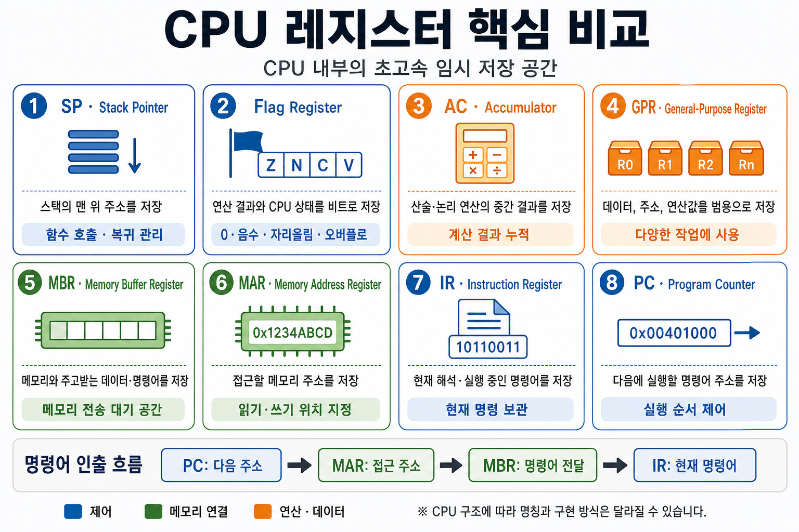

# Keyword : CPU register
## CPU register?
- CPU 레지스터(register)는 CPU 내부에 있는 초고속·초소형 임시 저장 공간이다.
- CPU가 현재 계산하거나 명령을 실행하는 데 필요한 값, 주소, 상태 등을 잠깐 보관하게 된다.
- 주요 레지스터는 다음과 같음.

  

## CPU Register - PC?
- Program Counter(PC)는 CPU가 다음에 실행할 명령어의 메모리 주소를 저장하는 레지스터이다.

## CPU Register - IR
- IR(Instruction Register, 명령어 레지스터)는 CPU가 현재 해석하거나 실행하고 있는 명령어를 저장하는 레지스터이다.

## CPU Register - MAR
- MAR(Memory Address Register, 메모리 주소 레지스터)는 CPU가 읽거나 쓸 메모리의 주소를 저장하는 레지스터입니다.
- CPU가 메모리에 접근할 때 MAR은 접근 위치를 지정하고, 실제 데이터는 MBR을 통해 이동한다.

## CPU Register - GPR
- GPR(General-Purpose Register, 범용 레지스터)은 CPU가 연산할 때 데이터, 주소, 중간 결과 등을 임시로 저장하는 다목적 레지스터이다.

## CPU Register - AC
- AC(Accumulator, 누산기)는 CPU의 산술·논리 연산에서 입력값이나 중간 결과를 임시로 저장하고 누적하는 레지스터이다.
## CPU Register(Flag Register)
- Flag Register(플래그 레지스터)는 CPU의 연산 결과와 현재 상태를 여러 개의 비트로 저장하는 레지스터이다. 

## CPU Register - SP(Stack Pointer)
- SP(Stack Pointer, 스택 포인터)는 메모리의 스택 맨 위 위치를 가리키는 주소를 저장하는 레지스터이다.