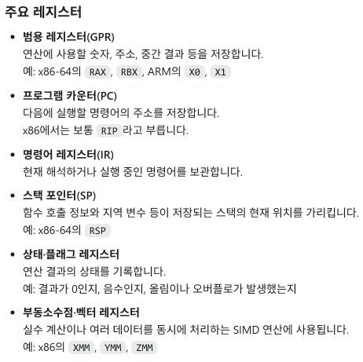

# Keyword : CPU register
## CPU register?
- CPU 레지스터(register)는 CPU 내부에 있는 초고속·초소형 임시 저장 공간이다. 
- CPU가 현재 계산하거나 명령을 실행하는 데 필요한 값, 주소, 상태 등을 잠깐 보관하게 된다.
- 주요 레지스터는 다음과 같음.

  

## Program Counter?
- Program Counter(PC)**는 CPU가 다음에 실행할 명령어의 메모리 주소를 저장하는 레지스터이다.
- 아키텍처에 따라 이름이 다르며, 예를 들어 x86-64에서는 RIP, ARM에서는 PC라고 부른다.