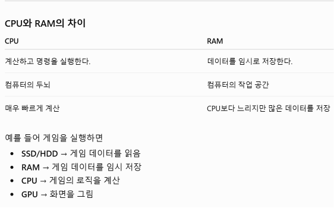
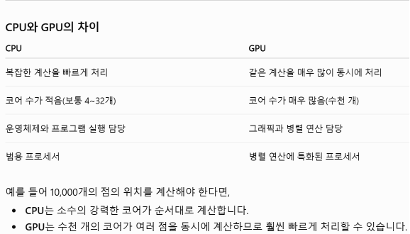

# CPU vs GPU
## CPU?
- CPU는 Central Processing Unit의 약자로, 우리말로는 중앙처리장치라고 한다. 
- 컴퓨터 프로그램의 명령어를 읽고, 해석하고, 실행하여 컴퓨터의 모든 작업을 처리하는 핵심 하드웨어이다.
- CPU는 크게 다음과 같은 일을 한다(아래와 같은 과정을 초당 수십억씩 반복함).
  1. 명령어를 가져온다(Fetch) : 메모리(RAM)에 저장된 프로그램의 명령어를 읽어온다.
  1. 명령어를 해석한다(Decode) : 읽어온 명령이 무엇을 하라는 것인지 분석한다(Ex. 더하기를 해라, 값을 저장해라 etc).
  1. 명령을 실행한다(Execute) : 실제 계산을 하거나 데이터를 이동시키는 작업을 수행한다.
  1. 참고

        
     
## GPU?
- GPU(Graphics Processing Unit, 그래픽 처리 장치)는 그래픽과 대량의 데이터를 동시에 빠르게 계산하기 위해 만들어진 프로세서이다.
- GPU는 화면에 표시되는 2D/3D 그래픽을 빠르게 계산하고 렌더링하는 전용 프로세서이다. 현재는 그래픽 처리뿐만 아니라 AI, 머신러닝, 과학 계산, 영상 편집 등 대량의 병렬 연산이 필요한 분야에서도 널리 사용된다.
- 쉽게 말해서, CPU가 '똑똑한 관리자'라면, GPU는 '수천 명의 작업자가 동시에 일하는 공장'이라고 생각할 수 있다.
- GPU의 역할
- GPU는 다음과 같은 작업을 담당한다.

    1. 게임 그래픽 처리
캐릭터, 배경, 그림자, 조명 등을 계산하여 화면에 표시합니다.
    1. 영상 처리 : 영상 인코딩 및 디코딩, 영상 효과 적용
    1. AI 연산 : 딥러닝 모델 학습, 생성형 AI(ChatGPT와 같은 AI)의 학습 및 추론
    1. 병렬 계산 : 수천 개의 데이터를 동시에 계산, 과학 시뮬레이션, 암호화폐 채굴 등에 활용
    1. 참고
        
        