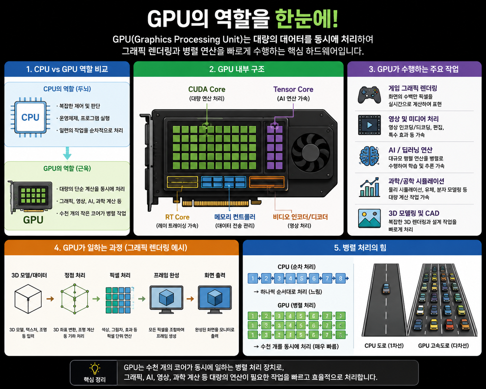

# Keyword : CUDA
## CUDA란?
- CUDA는 Compute Unified Device Architecture의 약자로, NVIDIA가 개발한 GPU 병렬 컴퓨팅 플랫폼이다. 
- GPU는 그래픽을 그리기 위한 장치였지만, CUDA가 등장하면서 GPU를 이용해 일반적인 계산(과학 계산, AI, 영상 처리 등)도 수행할 수 있게 되었다.
- CUDA 코어는 GPU 내부에서 다음과 같은 계산을 수행하는 작은 연산 장치이다.
  1. 덧셈, 뺄셈, 곱셈, 나눗셈
  1. 벡터연산
  1. 행열 계산의 일부
  1. AI 계산의 기본 연산 등
  1. 참고
 
    

