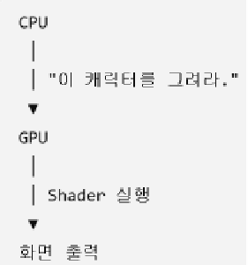

# Keyword : Computer Shader
## Computer Shader?
- 컴퓨터에서 셰이더(Shader) 는 GPU가 화면에 표시될 그래픽을 계산하는 프로그램이다.  
- 쉽게 말하면, "물체를 어떻게 그릴지 GPU에게 지시하는 코드"이다.
- CPU가 게임의 전체적인 로직을 담당한다면, GPU는 물체를 어디에 그릴지, 어떤 색으로 그릴지, 빛을 어떻게 받을지, 그림자를 어떻게 표현할지, 등을 엄청난 속도로 계산한다. 이때 GPU에게 계산 방법을 알려주는 프로그램이 바로 셰이더이다.

    

	