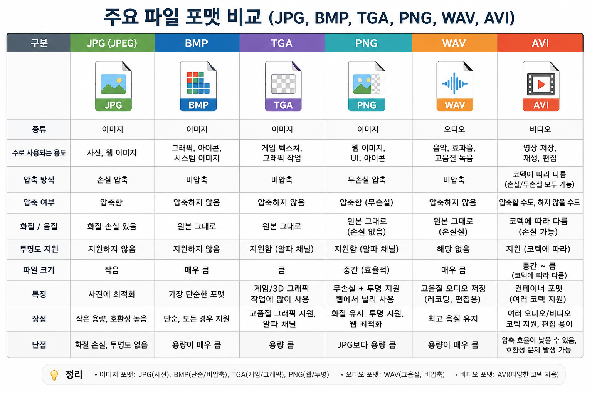

# Keyword : File Format
## File Format?
- 파일 포맷(File Format)은 컴퓨터가 파일 안에 저장된 데이터를 어떻게 구성하고 해석할지 정해 놓은 규칙(형식)이다.
- 쉽게 말하면, "물체를 어떻게 그릴지 GPU에게 지시하는 코드"이다.
- 파일 포맷에는 다음과 같은 내용이 포함된다.
    1. 데이터를 어떤 순서로 저장하는지
    1. 압축을 사용하는지
    1. 어떤 정보를 포함하는지
    1. 프로그램이 어떻게 읽어야 하는지

- 주요 파일 포맷 비교 

    