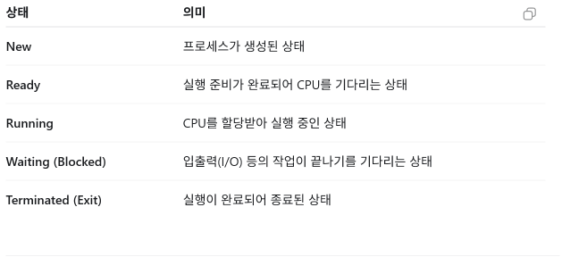

# PCB
## PCB - Process Staus란?
- PCB(Process Control Block)에서 **Process Status(프로세스 상태)**는 현재 프로세스가 어떤 상태에 있는지를 운영체제가 저장하는 정보이다.
- 운영체제는 여러 프로세스를 동시에 실행하는 것처럼 보이게 하기 위해 CPU를 매우 빠르게 번갈아 할당한다. 이때 각 프로세스의 상태를 PCB에 저장해 두어야 나중에 다시 실행할 수 있다.
- 대표적인 Process Staus(프로세스의 현재 실행 상태)
  
   