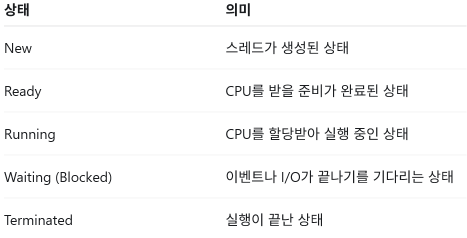

# TCB
## TCB(Thread Status)란?
- TCB(Thread Control Block)의 **Thread Status(스레드 상태)**는 스레드가 현재 어떤 실행 상태에 있는지를 운영체제가 저장하는 정보이다.
- 프로세스가 PCB(Process Control Block)로 관리되는 것처럼, 각 스레드는 TCB(Thread Control Block)로 관리된다. 운영체제는 TCB에 저장된 상태를 바탕으로 어떤 스레드에 CPU를 할당할지 결정한다.
- 대표적인 Thread Status(스레드의 현재 실행 상태)

  