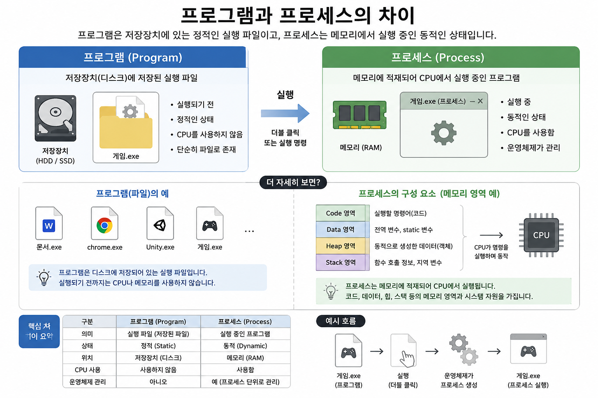
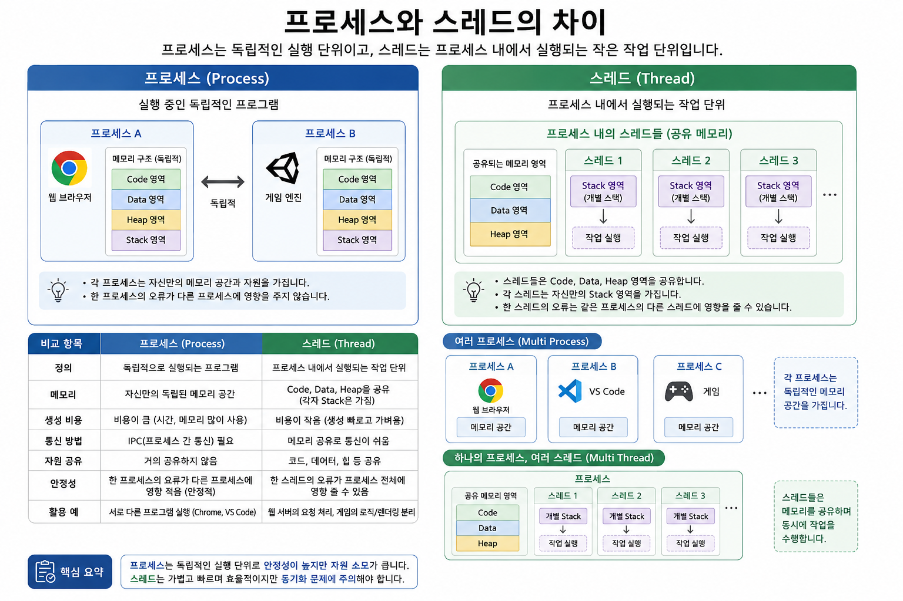

# Keyword : Thread And Process
## Thread?
- Thread(스레드)는 프로세스(Process) 안에서 실제로 작업을 수행하는 실행 단위이다.
- 비유해서 표현하자면, 프로세스가 회사라면, 스레드는 직원들이다.

## Process?
- 프로세스(Process)는 실행 중인 프로그램(Program in Execution)을 의미한다.
- 즉, 디스크에 저장되어 있는 프로그램(예: .exe 파일)을 실행하면 운영체제(OS)가 메모리에 적재하고 CPU가 실행을 시작하는데, 이때 메모리에서 실행되고 있는 프로그램을 프로세스라고 한다.

    

## Thread vs Process?

   